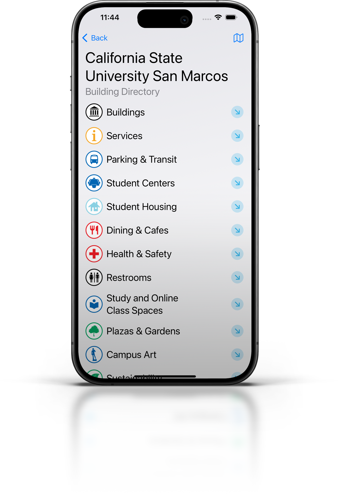
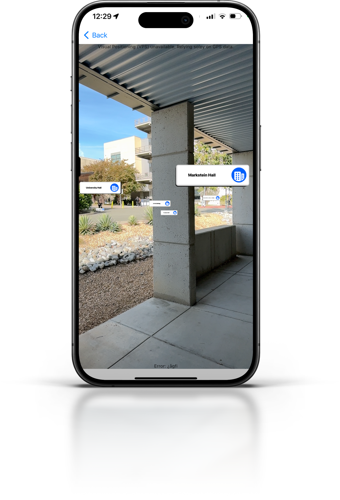
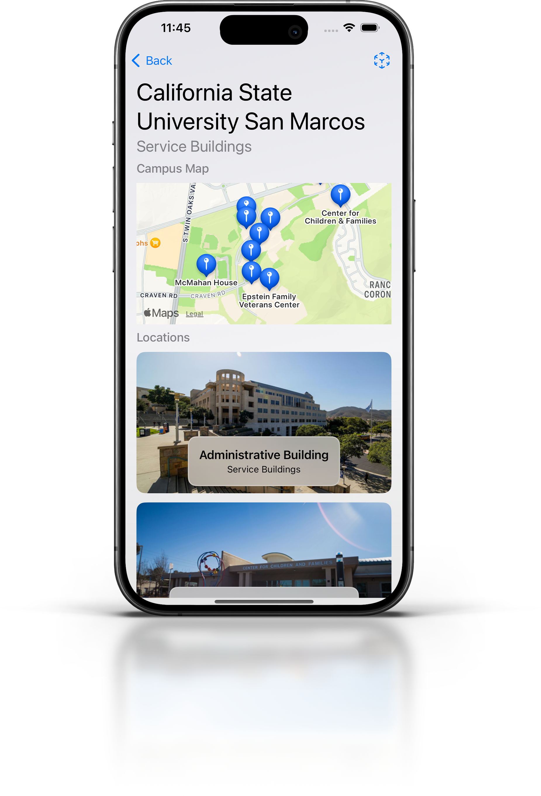
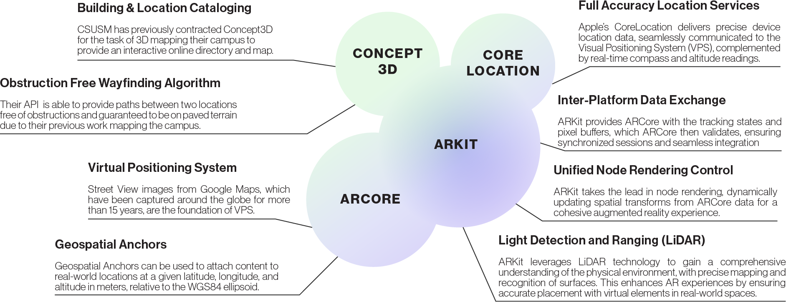

<!-- PROJECT LOGO -->
<br />
<div align="center">
  <a href="https://github.com/othneildrew/Best-README-Template">
    
  </a>

  # cougAR
  ### Campus Exploration and Navigation in Augmented Reality
  #### Capstone Project - California State University San Marcos

  <p align="center">
    <a href="assets/csusm-capstone-poster.pdf">View Presentation Poster</a>
    ·
    <a href="https://github.com/othneildrew/Best-README-Template">View Demo</a>
    ·
    <a href="https://github.com/othneildrew/Best-README-Template/issues">Report Bug</a>
    ·
    <a href="https://salmanburhan.github.io/csusm-augmented-reality-app/documentation/csusm_ar">Read the Docs</a>
  </p>
  <br />
  <br />
  
  
  
</div>


## Abstract
The CSUSM campus is expanding each year with new infrastructure, more students,
and various campus events. 

This year we have seen the largest incoming class CSUSM has ever had.
With these changes, students and visitors often struggle to locate classrooms,
study areas, event locations, and support facilities.

The objective of this AR (Augmented Reality) app is to help CSUSM students and
visitors learn about the campus, facilitate navigation around campus, and
increase community participation in campus events.

## Background
The main focus of this project was to provide location-based AR services to both Android and iOS users.

We chose to implement this application for both platforms in order to make it available to as many members of the community as possible.

In order to achieve a true native experience, the Android and iOS target were
set to be developed individually, with a mutual set of features.
This would also allow full access to the Augmented Reality frameworks provided
by both platforms rather than using third party frameworks in order to
facillitate communication to the native Augmented Reality framework.
(e.g. building using Flutter or React Native)

## iOS Implementation
This repository represents the iOS implementation of this project.
The Android application may be located on the repository listed below.

[](https://github.com/Sheldon101/Android_AR_APP)

The iOS implementation features the campus directory as it’s entry point.
For each category, the user is presented with a map marked with pins for the
locations along with the associated name. Within this view, the user may
request to begin an AR session which is set to render soley the locations in
that category. Featured campus events are also visible upon app launch, with an
ideal future direction linking event locations to a catalog one, allowing the
start of an AR session to locate that specific location via the pathfinding API
and visual representation of the path.

## The Plan
1. Complete iOS application developed using SOLID principles.
2. Augmented Reality implementation using ARKit, with geographic data supplemented by Geospatial API in Google’s ARCore.
3. Use existing mapping by Concept3D to query locations and return wayfinding paths pre-designed to avoid obstructions.
4. Linking Featured Events to physical locations in order to provide wayfinding experience in Augmented Reality.

## The Tech


## The Future
There are a number of features we would like to implement for this application
in the future. The next steps in this project include:

• The further development of the indoor navigation functionalities for all buildings on campus.

• Including additional information that may be helpful to users, such as emergency information and evacuation routes.

• Integrating authentication flow with CSUSM’s SAML implementation of SSO to make the app more personalized.

## Building
For a successful build/run, `Secrets.swift` file must be created within the project.
Each project collaborator should have a copy of this file with their sandbox key until released for production to California State University San Marcos.
The file should contain the following `struct` and values should be assigned for the relevant environment:
``` swift
struct Secrets {
    struct GoogleAPI {
        static let SandboxGoogleAPIKey: String?
        static let ProductionGoogleAPIKey: String? 
    }
    struct Concept3DAPI {
        static let baseURL: String?
        static let key: String?
        static let mapId: Int?
        static let cmsBaseURL: String?
    }
}
```
Access the Google API key using
``` swift
GoogleAPI.production.apiKey
GoogleAPI.sandbox.apiKey
```

Each project collaborator should also receive a copy of the `GoogleServices-Info.plist` file from the [repo owner](https://github.com/SalmanBurhan) to place in the `CSUSM AR` project diectory prior to building.


Access to the Concept3D API Key is not necessary as there is no need for distinguishing between sandbox and production environments at this time.
